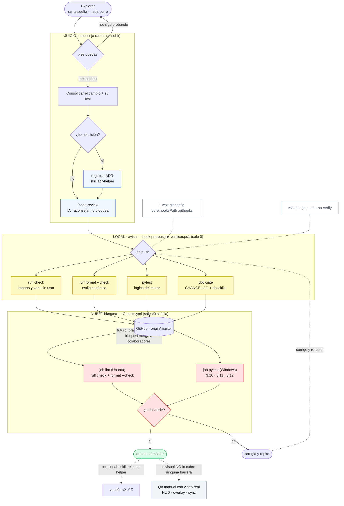
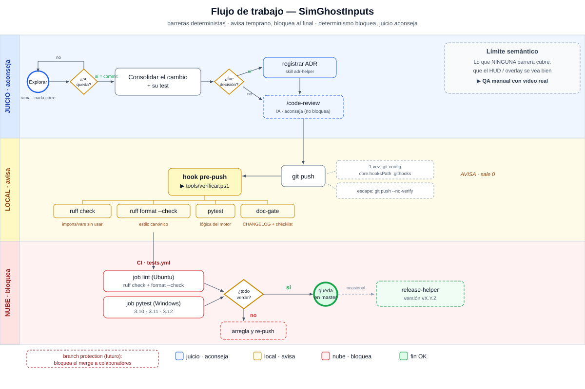

# Comparación de diagramas del flujo de trabajo (SCRATCH)

> Archivo **temporal** para comparar las opciones visualmente. **NO** es parte de la
> documentación oficial. Cuando elijas, la ganadora se integra a `flujo-de-trabajo.md`
> y esta carpeta `_diagramas/` se borra.
>
> **Cómo verlo renderizado:** abre este archivo en **Obsidian** (o VS Code → "Open Preview",
> `Ctrl+Shift+V`). El SVG ábrelo en **navegador / VS Code / Obsidian** (Windows Fotos no
> renderiza SVG y dice "inválido" — no es que el archivo esté roto).
>
> Versiones con **más detalle, en el punto de equilibrio**: fase Explorar→¿se queda?, rama de
> decisión→ADR, qué atrapa cada check, los 2 jobs del CI, las skills que asisten, la
> precondición del hook y el escape `--no-verify`, la frontera de versión, branch protection y
> el límite semántico.

---

## Opción B — Mermaid (texto-en-repo, se renderiza en Obsidian / GitHub / VS Code)

---

## Opción C — BPMN formal (imagen SVG)

Notación BPMN con carriles, evento inicio/fin ◯◉, gateways ◇, los 2 jobs del CI, qué atrapa
cada check, notas de precondición/escape, leyenda y el callout del límite semántico.

---

## Resumen

| | Bonito | Texto en repo | Aguanta detalle | Drift |
| :-- | :-- | :-- | :-- | :-- |
| **B — Mermaid** | diagrama con color | sí | mucho (auto-acomoda) | ninguno |
| **C — BPMN/SVG** | notación pro, nítido | imagen (binario) | medio (se acomoda a mano) | sí |

**Recomendación:** **Mermaid (B)** como diagrama canónico en `flujo-de-trabajo.md`; **SVG (C)**
además como "portada" visual si te gusta más vistoso (binario, se mantiene a mano).
