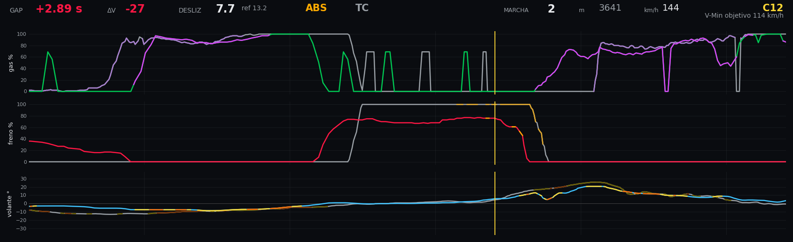

# Referencia del HUD (overlay)

El overlay HUD-A es un video con canal alfa (fondo transparente) de la duración exacta
de la vuelta del piloto. Se pega como pista superior sobre la grabación del sim para
obtener el video de análisis.

---

## Anatomía del HUD

```
┌──────────────────────────────────────────────────────────────────────┐
│  GAP +0.41s │ ΔV -8 │ DESLIZ 1.2 │ ABS TC │ GASTO 12 │ M 3 │ 187 km/h │ 3412 m │
│                                                                      │
│  PANEL GAS          PANEL FRENO          PANEL VOLANTE              │
│  ─────────────      ─────────────         ─────────────             │
│  ▲ 100%             ▲ 100%                ▲ derecha                  │
│  │  ╔══╗            │   ╔╗                │     ╔═╗                  │
│  │  ║  ║  piloto    │   ║║  piloto        │     ║ ║ piloto          │
│  │──╫──╫──────────  │───╫╫───────────────│─────╫─╫──── cursor      │
│  │  ╚══╝            │   ╚╝                │     ╚═╝ referencia      │
│  ▼ 0%              ▼ 0%                  ▼izquierda                  │
│                   ◄──────────────────────────►                       │
│                  -320m    CURSOR    +200m                            │
└──────────────────────────────────────────────────────────────────────┘
```

### Franja de datos (parte superior)

| Campo | Qué muestra | Cuándo es útil |
| :-- | :-- | :-- |
| **GAP** | Diferencia de tiempo acumulada respecto a la referencia en el metro actual. Positivo (rojo) = el piloto va más lento; negativo (verde) = más rápido. | Ver si estás ganando o perdiendo tiempo en cada sección. |
| **ΔV** | Diferencia de velocidad puntual (piloto − referencia) en el metro exacto donde está el cursor. Negativo = más lento. | Identificar dónde no estás llegando a la velocidad de la referencia. |
| **DESLIZ** | Índice de deslizamiento de las ruedas (velocidad de rueda vs velocidad real) sobre los ~40 m **detrás** del cursor — el maltrato que la goma acaba de sufrir, no el promedio de toda la pantalla. Proxy de desgaste; muestra el del piloto y el `ref`. | Monitorear si eres más agresivo con el neumático que la referencia. Es la base del medidor `fantasma wear`. |
| **ABS / TC** | Luces de estado: el texto se enciende en su color (ABS ámbar, TC violeta) cuando el ABS / control de tracción del piloto está activo **en el cursor**, con una retención corta (~8 m) para no parpadear. Apagado = gris. | Ver en el momento exacto si estás bloqueando (ABS) o pasándote de gas (TC). |
| **GASTO** | Desgaste **acumulado de la vuelta** (la *carga de deslizamiento*): cuánto ha gastado la goma desde meta hasta el cursor (piloto y `ref`). **No es DESLIZ** — DESLIZ es *intensidad* (qué tan duro castigas la goma **ahora**); GASTO es *cantidad* acumulada (cuánto llevas gastado). Solo crece a lo largo de la vuelta. | Ver cuánta goma llevas gastada y si gastas más que la referencia. |
| **M** / **MARCHA** | Marcha actual del piloto (1–6 / N / R). | Verificar sincronía visual: comparar con el marcador de marcha del sim. |
| **km/h** | Velocidad instantánea del piloto. | Verificar sincronía y detectar diferencias de velocidad punta en rectas. |
| **metros** | Distancia recorrida en la vuelta desde meta. | Referencia espacial; úsalo con el vídeo para confirmar en qué metro estás. |
| **Curva / V-Min objetivo** (arriba a la derecha) | Nombre de la curva actual —del track pack, si lo cargaste con `--corners`; si no, el `id` `C01`…— y debajo su **V-Min objetivo** (la velocidad de paso de la referencia en esa curva) en km/h. | Saber en qué curva vas y a qué velocidad de paso apuntar. |

---

## Los tres paneles

Cada panel muestra **una ventana deslizante de 520 m** centrada en el cursor (320 m hacia atrás,
200 m hacia adelante). Eje horizontal = distancia de vuelta en metros; eje vertical = intensidad del canal.

El **cursor** (línea amarilla vertical) es el instante actual. Lo que está a la izquierda ya pasó;
lo que está a la derecha es lo que viene.

Cada panel tiene **dos líneas**: el **piloto** (brillante) y la **referencia** (apagada/gris).
La diferencia visual entre ambas líneas es la historia del delta: si la línea del piloto va por encima
de la referencia en freno, el piloto está frenando más fuerte; si el gas del piloto sube más tarde,
está tardando más en abrir.

---

## Código de colores

> El overlay **no** lleva leyenda de colores en pantalla (ADR 0007): el HUD se ve en
> movimiento y una leyenda ocuparía espacio sin consultarse a mitad de vuelta. **Esta
> sección es la leyenda.**

Frame de referencia (BMW M4 GT3, Nordschleife) para ubicar cada elemento — la franja de
datos arriba, y debajo los tres paneles (gas / freno / volante) con piloto vs referencia:



En este frame se ve: el **GAP** en rojo (piloto detrás de la referencia), las **luces ABS/TC**
(ABS ámbar encendido, TC gris apagado), el segmento **ámbar** dentro de la línea de freno
(ABS actuando), el **violeta** en la línea de gas (TCS actuando) y la línea **gris** de la
referencia bajo la del piloto en cada panel. Las tablas siguientes detallan cada color.

### Panel de gas (acelerador)

| Color | Quién | Qué significa |
| :-- | :-- | :-- |
| **Verde vívido** `#00c853` | Piloto | Aceleración normal |
| **Violeta vívido** `#e040fb` | Piloto | TCS activo (el sim está limitando el gas por deslizamiento) |
| **Gris** `#9aa0a6` | Referencia | Gas normal de la referencia |
| **Violeta tenue** `#a87fd0` | Referencia | TCS activo en la referencia (subido de brillo para que se vea) |

### Panel de freno

| Color | Quién | Qué significa |
| :-- | :-- | :-- |
| **Rojo vívido** `#ff1744` | Piloto | Frenada normal |
| **Ámbar vívido** `#ffab00` | Piloto | ABS activo (ruedas bloqueando) |
| **Gris** `#9aa0a6` | Referencia | Freno normal de la referencia |
| **Ámbar tenue** `#e0a526` | Referencia | ABS activo en la referencia (subido de brillo para que se vea) |

### Panel de volante (steering)

| Color | Quién | Qué significa |
| :-- | :-- | :-- |
| **Azul claro** `#40c4ff` | Piloto | Giro dentro de la carga lateral normal (< P75 de la referencia) |
| **Amarillo** `#fdd835` | Piloto | Carga lateral media — entre P75 y P90 del G-lat de la referencia |
| **Naranja** `#ff6d00` | Piloto | Carga lateral alta — por encima del P90 del G-lat de la referencia |
| **Gris** `#9aa0a6` | Referencia | Ángulo normal de la referencia |
| **Amarillo apagado** `#6b5e00` | Referencia | Zona de carga lateral media (referencia) |
| **Naranja apagado** `#7a3300` | Referencia | Zona de carga lateral alta (referencia) |

> **¿Por qué los umbrales del volante son relativos a la referencia?**
> Los percentiles P75 y P90 del `|G-lat|` se calculan sobre la vuelta de referencia. Así «amarillo»
> significa «trabajando al mismo nivel que la referencia» y «naranja» significa «más allá de donde
> normalmente trabaja la referencia en esa zona». No necesitas calibrar nada manualmente.

---

## Cómo leer el HUD en la práctica

### ¿Dónde estoy perdiendo tiempo?

1. Mira el **GAP**: si sube (se pone más rojo/positivo) en una frenada, estás perdiendo tiempo ahí.
2. Compara las líneas de freno: si la tuya (roja) aparece ANTES que la de la referencia (gris), frenas antes. Si aparece DESPUÉS, frenas más tarde.
3. Compara las líneas de gas: si la referencia (gris) sube antes que la tuya (verde) en la salida de una curva, la referencia abre gas antes.

### Señales de alerta comunes

| Lo que ves | Qué significa |
| :-- | :-- |
| Línea de piloto en violeta frecuente | TCS corrigiendo mucho — posible exceso de gas en salidas |
| Línea de piloto en ámbar frecuente | ABS disparándose — posible punto de frenada demasiado agresivo |
| Volante naranja donde la referencia es azul | Piloto generando más G-lat — línea diferente o mayor velocidad de paso |
| GAP aumentando en zona de gas | El piloto está tardando más en retomar velocidad después de la curva |
| GAP estable en rectas pero aumentando en curvas | El problema es el ápex, no la potencia |

### Verificar la sincronía

Los campos **MARCHA**, **km/h** y **metros** en la franja superior permiten confirmar que
el overlay y el video de grabación están alineados:

- Pausa el video en un momento reconocible (p. ej. entrada a una curva lenta).
- Compara la marcha que muestra el HUD con la que muestra el sim en el video.
- Si no coinciden, ajusta el offset con `fantasma compose --offset` o `--auto-sync`.

### Preview con Pace Notes

`fantasma compose` también puede mezclar un pack de Pace Notes en el audio del video para
probar cómo se sienten los sonidos junto al HUD antes de llevarlos a CrewChief:

```
fantasma compose --video grabacion.mp4 --overlay salida/overlay.webm \
    --driver mi_outing.csv --pace-notes-dir salida/pace_notes -o preview_pacenotes.mp4
```

El HUD no cambia visualmente. El comando convierte los metros de `metadata.json` a segundos usando
la telemetría del piloto (`--driver`) y mezcla los WAVs como una pista de audio de preview.

---

## Avisos en el reporte de comparación

`report.md` (generado por `fantasma compare`) incluye un bloque de **Avisos** cuando `compare()` detecta condiciones anómalas. Actualmente:

| Aviso | Condición |
| :-- | :-- |
| Delta sospechosamente grande | `abs(total_delta) > ref_laptime * 0.5` — posible mezcla de circuitos distintos |
| Autos distintos | Metadato `Vehicle` disponible en ambas vueltas y difiere — informativo, no bloquea el cálculo |

Estos avisos también se imprimen en `stderr` al usar `fantasma compare` por CLI.

---

## Opciones de renderizado

```
# Formato recomendado: WebM VP9 con alpha (compatible con cualquier editor)
fantasma overlay --reference ref.csv --driver mi.csv -o salida/ --format webm

# Máxima calidad: ProRes 4444 (para DaVinci Resolve / Final Cut)
fantasma overlay --reference ref.csv --driver mi.csv -o salida/ --format prores

# Solo el tramo de las 3 curvas problemáticas (más rápido para iteración)
fantasma overlay --reference ref.csv --driver mi.csv -o salida/ --start 120 --end 180

# Render en lote de todas las vueltas completas de la sesión
fantasma overlay --reference ref.csv --driver mi.csv -o salida/ --all-laps
```

El render usa automáticamente todos los núcleos disponibles (`cpu_count() - 1` workers). Cada worker
recibe solo el segmento de arrays que necesita (slice por rango de distancia), lo que reduce el
overhead de serialización de ~4 MB a ~1 MB por worker en vueltas largas (Nordschleife).
