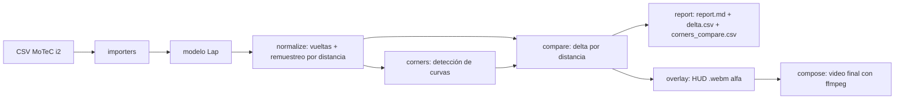

# Arquitectura — el paquete `fantasma/`

Vista general del CÓMO. Esqueleto arc42 §3 (estructura) + §5 (bloques) + §6 (runtime). El detalle
de cada algoritmo vive en [`especificaciones/`](especificaciones/); el modelo de datos canónico y el
algoritmo de detección **siguen siendo dueños** de [`../docs/formato-datos.md`](../docs/formato-datos.md)
(esta nota enlaza, no duplica — ver [ADR 0015](../docs/decisions/0015-estructura-product-engineering.md)).

## Principio rector: núcleo sin dependencias

`pyproject.toml` declara `dependencies = []`. El **núcleo** (`core/` + `importers/`) es **librería
estándar pura**: importa, normaliza, detecta curvas y compara **sin** matplotlib, scipy, numpy ni
openpyxl. Todo lo pesado vive en **extras opcionales** que **degradan con gracia** si faltan:

| Extra | Habilita | Deps |
|---|---|---|
| `xlsx` | leer `.xlsx` de MoTeC i2 | openpyxl |
| `charts` | gráficas ghost y mapa de delta | matplotlib |
| `overlay` | HUD de video | Pillow, matplotlib, numpy |
| `sync` | auto-sync video/telemetría | scipy, numpy |
| `ui-ng` | interfaz NiceGUI v2.0 | nicegui, pywebview, pandas |
| `voice` | coaching de voz (pace notes) | edge-tts |

Es uno de los [principios de diseño](../PRODUCT_BRIEF.md) no negociables: el núcleo funciona en
cualquier Python ≥ 3.10; cada función avanzada se instala solo si se necesita.

## Bloques (capas del paquete)

```text
fantasma/
  core/        NÚCLEO — sin dependencias. El motor.
    lap.py         modelo de datos Lap (canales canónicos por distancia)
    normalize.py   separación de vueltas, vuelta más rápida, remuestreo por distancia
    corners.py     detección de curvas e hitos (V-Min, frenada, ápex, gas)
    compare.py     comparación piloto vs referencia (delta continuo, tiempo perdido)
    wear.py        desgaste de goma acumulable de un stint
  importers/   lectura de archivos -> modelo Lap
    motec_csv.py   MoTeC i2 CSV/XLSX
    generic_csv.py CSV genérico con mapeo de columnas
    _util.py       utilidades compartidas
  viz/         VISUALIZACIÓN Y VIDEO — usa extras opcionales
    charts.py      gráficas (delta map, G-G, curvas)
    overlay.py     HUD animado con canal alfa (+ _overlay_worker.py para render paralelo)
    compose.py     composición con ffmpeg (NVENC si hay GPU NVIDIA)
    sync.py        auto-detección de offset por correlación de audio
    report.py      reporte Markdown + CSVs de salida
    pacenotes.py   generador de pack de pace notes CrewChief (tonos + voz)
    hud_preview.py preview reactiva del HUD para la UI NiceGUI
  ui/          INTERFAZ — NiceGUI v2.0, opcional
    ng_app.py      entry point NiceGUI v2.0 (router principal, CSS global)
    ng_state.py    AppState proxy sobre app.storage.user
    ng_helpers.py  constantes, CSS vars, helpers compartidos
    ng_step0-4.py  los pasos del wizard NiceGUI
  cli.py       PUNTO DE ENTRADA (consola `fantasma`)
```

## Superficie de comandos (CLI primero)

La UI es una capa opcional sobre el CLI; todo lo que hace la UI se puede hacer en terminal.

| Comando | Qué hace | Capa |
|---|---|---|
| `fantasma laps` | lista las vueltas de un archivo | core + importers |
| `fantasma detect` | detecta curvas e hitos de la vuelta más rápida | core |
| `fantasma compare` | compara piloto vs referencia → reporte + CSVs + gráficas | core + viz |
| `fantasma overlay` | genera el HUD `.webm` con canal alfa | viz (`overlay`) |
| `fantasma compose` | superpone el HUD sobre el video con ffmpeg | viz |
| `fantasma wear` | medidor de desgaste acumulable de un stint | core |
| `fantasma-ng` | abre la interfaz NiceGUI v2.0 en ventana de escritorio nativa | ui (`ui-ng`) |

## Flujo de datos (runtime)



La **comparación es por distancia, no por tiempo**: el metro de pista es el índice maestro. Detalle
del modelo y el remuestreo en [`../docs/formato-datos.md`](../docs/formato-datos.md).

## Decisiones técnicas relevantes (ADRs)

- Comparación por distancia y auto-sync → [ADR 0001](../docs/decisions/0001-sync-offset.md), [ADR 0008](../docs/decisions/0008-sync-multivuelta-candidatos.md)
- Estrategia de pruebas → [ADR 0003](../docs/decisions/0003-testing.md) (consolidado en [`pruebas.md`](pruebas.md))
- Desgaste acumulable → [ADR 0004](../docs/decisions/0004-desgaste-acumulable.md), [ADR 0009](../docs/decisions/0009-unidad-desgaste-acumulado.md)
- HUD (jerarquía visual, sin leyenda) → [ADR 0005](../docs/decisions/0005-indicadores-instantaneos.md)–[ADR 0007](../docs/decisions/0007-hud-sin-leyenda.md)
- UI Streamlit (front custom diferido a v2.0) → [ADR 0010](../docs/decisions/0010-framework-ui-streamlit.md)
- Framework UI: NiceGUI (enmienda al ADR 0010) → [ADR 0018](../docs/decisions/0018-framework-ui-nicegui.md)
- CrewChief Pace Notes → [ADR 0002](../docs/decisions/0002-crewchief-pacenotes.md)

## Relacionado con
- [[pruebas]]
- [Formato de datos (modelo canónico)](../docs/formato-datos.md)
- [Brief de Producto](../PRODUCT_BRIEF.md)
