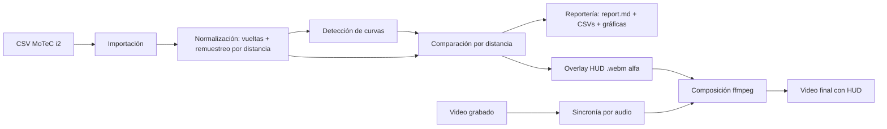

# Pipeline de análisis y overlay

> Vista de tiempo de ejecución: cómo fluye una sesión desde el CSV hasta el reporte y el video. Atan las dos soluciones sobre el mismo motor.

## Diagrama

## Resumen del flujo
1. **Importar** el CSV al modelo canónico ([[Importación de telemetría]]).
2. **Normalizar:** separar vueltas, elegir la más rápida, remuestrear por distancia ([[Normalización y comparación]]).
3. **Detectar curvas** y **comparar** piloto vs referencia ([[Detección de curvas e hitos]], [[Normalización y comparación]]).
4. **Bifurca en las dos soluciones:**
   - [[Análisis Post-Tanda]] → reporte + gráficas ([[Reportería]]).
   - [[Overlay de Video]] → HUD, auto-sync con el video, composición ([[Overlay y composición de video]], [[Sincronía audio-video]]).

## Dominios / módulos que toca
- Todos los dominios del motor (comparten importación, normalización y comparación) más los específicos de cada solución.

## Relacionado con
- [[Análisis Post-Tanda]]
- [[Overlay de Video]]
- [[arquitectura]]
