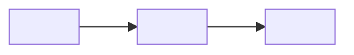

# <Nombre del proceso / BPMN>

> Vista de tiempo de ejecución: cómo fluye un proceso de punta a punta. (arc42 §6 Runtime View.) Prefiere Mermaid embebido (texto, versiona y rinde en Obsidian/GitHub).

## Diagrama

## Resumen del flujo
<Qué representa el proceso, los actores y el resultado. En 3-5 pasos.>
1. <Paso.>

## Dominios / módulos que toca
- [[<dominio o módulo>]]

## Relacionado con
- [[<ecosistema, solución o módulo>]]

<!--
Un PROCESO documenta un flujo de punta a punta. El diagrama (Mermaid o .drawio) es la fuente;
esta nota da el contexto navegable y enlaza a los dominios/módulos involucrados. Borra este comentario.
-->
